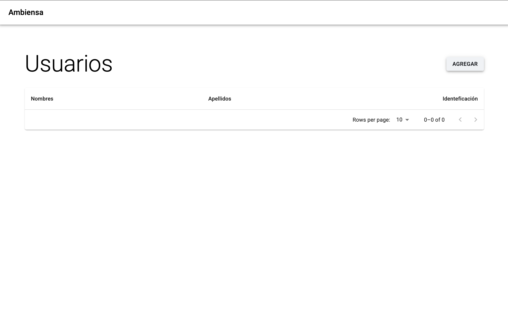
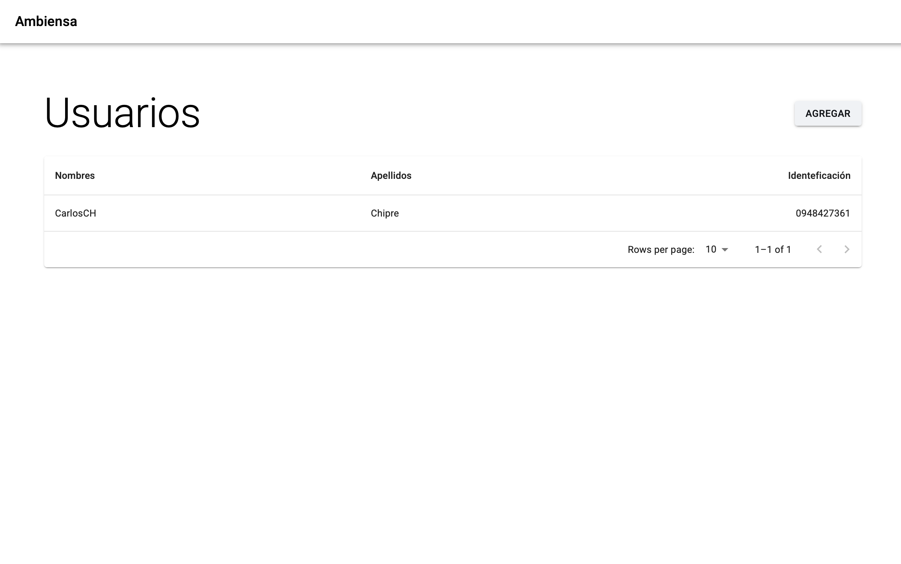

# registro_usuarios
Formulario para registro de usuario con React y Laravel

# registro_usuarios

Formulario de registro de usuario con React (frontend) y Laravel (API backend).

## Tabla de Contenidos

- [Descripción](#descripción)
- [Requisitos](#requisitos)
- [Instalación](#instalación)
- [Configuración](#configuración)
- [Ejecución en Desarrollo](#ejecución-en-desarrollo)
  - [Backend Laravel](#backend-laravel)
  - [Frontend React](#frontend-react)
- [Compilación para Producción](#compilación-para-producción)
  - [API Laravel](#api-laravel)
  - [React](#react)
- [Opcional: Docker](#opcional-docker)
- [Licencia](#licencia)

## Descripción

Este proyecto consta de un formulario de registro de usuarios construido con:
- **Frontend:** React
- **Backend:** API REST en Laravel
- **Base de datos:** PostgreSQL

## Requisitos

- PHP ≥ 8.2
- Composer
- Node.js ≥ 18
- npm o yarn
- PostgreSQL
- Docker y Docker Compose

## Instalación

1. Clona el repositorio:
   ```bash
   git clone <url-del-repositorio>
   cd registro_usuarios
   ```
2. Instala dependencias del backend:
   ```bash
   cd backend
   composer install
   ```
3. Instala dependencias del frontend:
   ```bash
   cd ../frontend
   npm i
   ```

## Configuración

1. Copia los archivos de entorno en el backend:
   ```bash
   cd backend
   cp .env.example .env
   ```
2. Edita `.env` y configura la conexión a tu base de datos PostgreSQL:
   ```
   DB_CONNECTION=pgsql
   DB_HOST=localhost
   DB_PORT=5432
   DB_DATABASE=PruebaGF
   DB_USERNAME=postgres
   DB_PASSWORD=secret
   ```

## Ejecución en Desarrollo

## Base de datos

Desde la `carpeta raíz` y ejecuta:

```bash
docker-compose up -d --build
```

Esto levantará los contenedores de la base de datos.

### Backend Laravel

Desde la carpeta `backend`:

```bash
php artisan serve --host=127.0.0.1 --port=8000
```

La API estará disponible en `http://127.0.0.1:8000` o `http://localhost:8000`.

### Frontend React

Desde la carpeta `frontend`:

```bash
npm run dev
```

El frontend se servirá en `http://localhost:5173` (o el puerto configurado).

## Capturas de Pantalla

A continuación se muestran algunas capturas del funcionamiento de la aplicación:

### Pantalla principal



### Formulario registro de usuario


Los campos deben ser correctamente llenados, sino dará error.

### Ejemplo de registro.


### Usuario guardado.



### Editar datos


## Licencia

Este proyecto está bajo la licencia MIT.